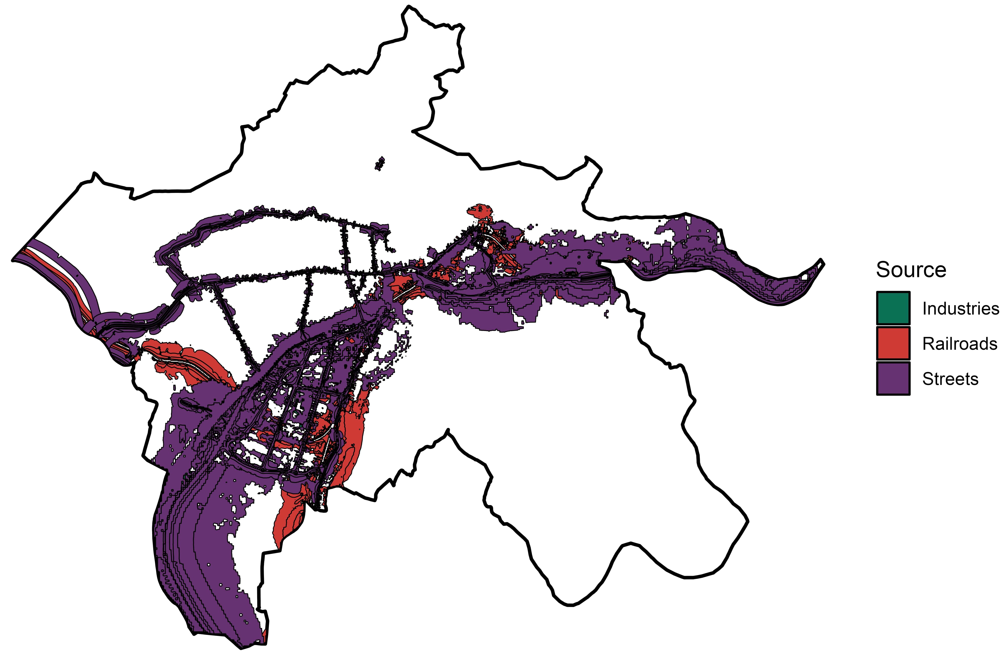
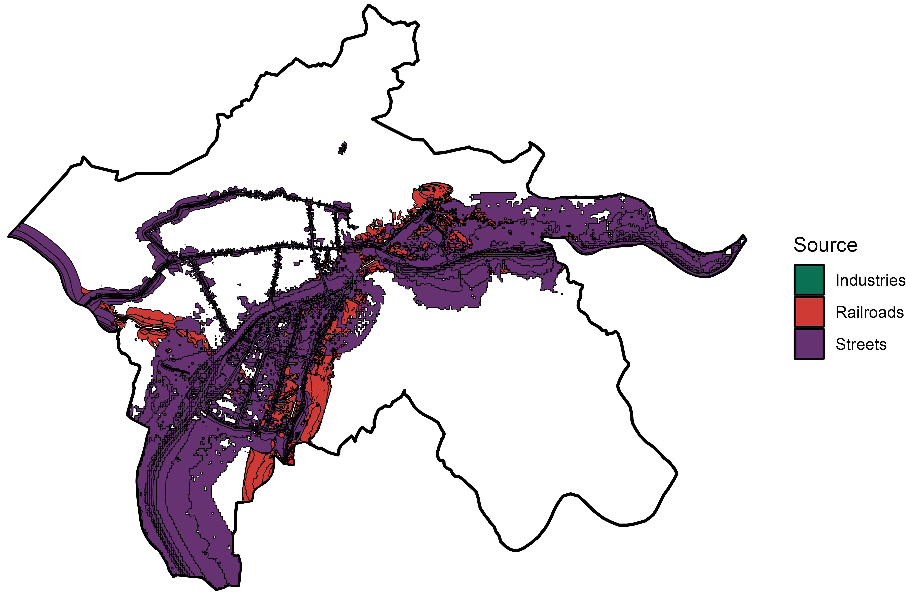

# Noise and Air Pollution in Europe Cities

## Abstract

Environmental noise is part of the daily life of many people. This might be particularly true for the European Union (EU). As one of the world's densely populated and urbanized areas, most people will likely be affected by high environmental noise levels since extensive infrastructure and transportation networks are the main contributors to noise pollution.

Noise pollution substantially impacts the affected local community's physical, mental, and general well-being. Academic research confirmed the consequences of high environmental noise levels on human health (Boes et al., 2013; Schlenker & Walker, 2016) and overall well-being (Lawton & Fujiwara, 2016). Environmental noise can be associated with cardiovascular diseases, high blood pressure, high heart rates, and lower sleep quality (Babisch et al., 2005; Münzel et al., 2014; Vienneau et al., 2015). So, noise pollution is generally disturbing and detrimental to the individual's health.

## Selective Outputs

### Noise Pollution in Bolzano (Italy)

   
  
  
<strong>Figure 1: Noise Pollution in Bolzano (Day vs Night)</strong>

<strong>Key points:</strong>

<u style="text-decoration: none;">
    <li>Identified noise sources: Industrial plants, railroads, and streets</li>
    <li>Street noise is the most prominent source</li>
    <li> Noise sources are clustered in the west and the city center; large areas
    in the south and (partially) in the north are completely noise-free</li>
</u>

## Sources

- Babisch, W., Beule, B., Schust, M., Kersten, N., & Ising, H. (2005). Traffic Noise and Risk of Myocardial Infarction. Epidemiology, 16 (1), 33–40. https://doi.org/10.1097/01.ede.0000147104.84424.24.
- Boes, S., Nüesch, S., & Stillman, S. (2013). Aircraft Noise, Health, and Residential Sorting: Evidence from Two Quasi-Experiments. Health Economics, 22 (9), 1037–1051. https://doi.org/10.1002/hec.2948.
- Lawton, R. N., & Fujiwara, D. (2016). Living with Aircraft Noise: Airport Proximity, Aviation Noise and Subjective Wellbeing in England. Transportation Research Part D: Transport and Environment, 42, 104–118. https://doi.org/10.1016/j.trd.2015.11.002.
- Münzel, T., Gori, T., Babisch, W., & Basner, M. (2014). Cardiovascular Effects of Environmental Noise Exposure. European Heart Journal, 35 (13), 829–836. https://doi.org/10.1093/eurheartj/ehu030.
- Schlenker, W., & Walker, W. R. (2016). Airports, Air Pollution, and Contemporaneous Health. The Review of Economic Studies, 83 (2), 768–809. https://doi.org/10.1093/restud/rdv043.
- Vienneau, D., Schindler, C., Perez, L., Probst-Hensch, N., & R¨o¨osli, M. (2015). The Relationship Between Transportation Noise Exposure and Ischemic Heart Disease: A Meta-Analysis. Environmental Research, 138, 372–380. https://doi.org/10.1016/j.envres.2015.02.023.

## Disclaimer
This repository and the corresponding output have been part of the project: Activation of NATURE-based solutions for a JUST low carbon transition funded by European Commission, Horizon 2020. All rights reserved the author of the code [Dr. Patrick Thiel](https://www.rwi-essen.de/rwi/team/person/patrick-thiel).